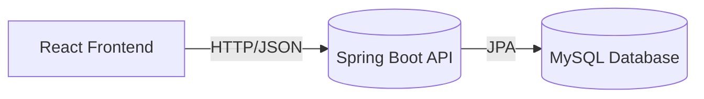
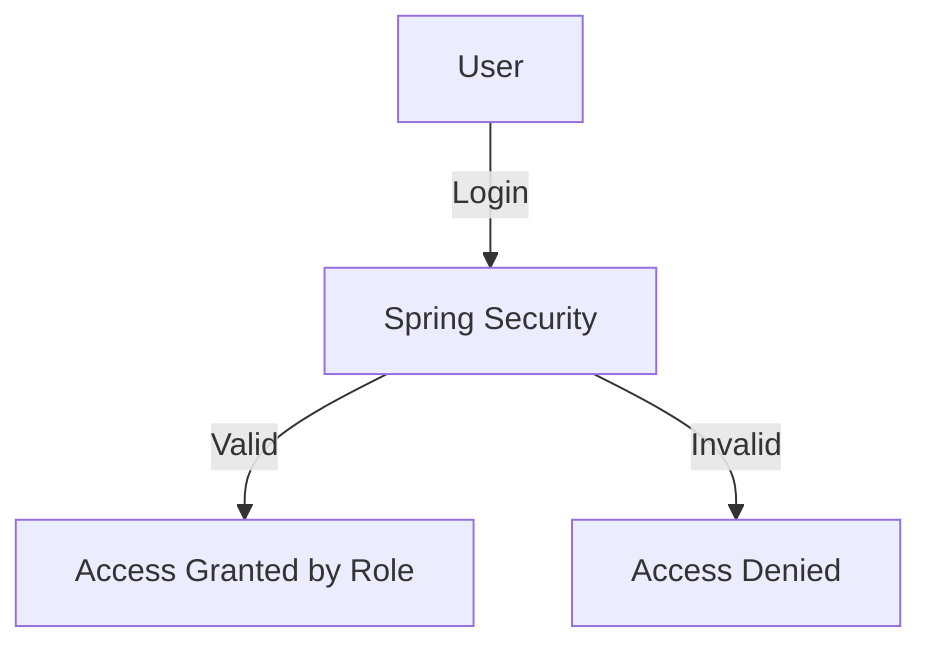

# Capture The Flag (CTF) Web Platform for Cybersecurity Education


A beginner-friendly web-based platform designed to help cybersecurity students build foundational practical skills through hands-on ethical hacking challenges.

---

## 🎥 Demo (Screenshots Preview)

<details>
<summary><strong>Click to view demo preview</strong></summary><br>

<br><br>
<br><br>


</details>

---

## 📌 Table of Contents
- [About the Project](#-about-the-project)
- [Features](#-features)
- [System Architecture](#-system-architecture)
- [Technology Stack](#-technology-stack)
- [Getting Started](#-getting-started)
- [Usage](#-usage)
- [Testing](#-testing-overview)
- [Screenshots & User Manual](#-screenshots--user-manual)
- [Roadmap / Future Enhancements](#-roadmap--future-enhancements)
- [License](#-license)
- [Author](#-author)

---

## 🧩 About the Project

Cybercrime cases continue to rise globally, yet beginners often lack a safe and accessible environment to learn cybersecurity practically.  
This project addresses that challenge by offering a safe and guided platform to build practical ethical hacking skills.

✅ Beginner‑friendly challenges  
✅ Practical exposure to security concepts  
✅ Safe simulated environment  

---

## ✅ Features

| Category | Features |
|---------|----------|
| User | Register, Login, Attempt Challenges, Submit Flags, Track Progress |
| Admin | Manage Users |
| Lecturer | Manage Categories, Challenges & Feedback |
| Learning Support | Hints, Stars, Feedback system |

---

## 🧱 System Architecture

The platform is designed using **REST‑based MVC architecture**, ensuring modularity and scalability.



### 🔐 Authentication Flow
- Spring Security w/ JWT & role‑based access control
- Secure password hashing (BCrypt)



---

## 🛠 Technology Stack

| Layer | Tools |
|------|------|
| Frontend | React.js, Axios |
| Backend | Spring Boot, Spring Security |
| Database | MySQL |
| Development Tools | IntelliJ IDEA, VS Code, Git & GitHub |
| Design / Documentation | Figma, PlantUML |

---

## 🚀 Getting Started

### ✅ Requirements
- Node.js (v16+)
- Java JDK 17+
- MySQL Server
- Git

### 🔧 Installation

#### 1️⃣ Clone Repository
```bash
git clone https://github.com/Abdu1R4hmn/Capture-The-Flag-Website.git
cd Capture-The-Flag-Website
```

#### 2️⃣ Backend Setup
```bash
cd backend
mvn clean install
```
Configure database in:
```
src/main/resources/application.properties
```
Then run backend:
```bash
mvn spring-boot:run
```
➡ Backend API: http://localhost:8080

#### 3️⃣ Frontend Setup
```bash
cd ../frontend
npm install
npm run dev
```
➡ Frontend: http://localhost:5173

---

## 🕹 Usage
1. Create account & log in
2. Choose a challenge
3. Submit flag to earn stars
4. View completion progress
5. Admin/Lecturer dashboard unlocked by roles

---

## 🧪 Testing Overview

| Testing Type | Coverage |
|--------------|----------|
| White‑box | Backend logic, security testing |
| Black‑box | UX + functional behavior |
| UAT | Real user workflow testing |

---

## 🖼 Screenshots & User Manual

<details>
<summary><strong>Click to Expand</strong></summary>

### User Interface
- Login Page — ``  
- Register Page — ``  
- Challenges Page — ``  
- Challenge Modal — ``  
- Profile Page — ``  

### Admin Interface
- Dashboard — ``  
- User Management — ``  

### Lecturer Interface
- Category Management — ``  
- Challenge Management — ``  
- Feedback Management — ``  

</details>

---

## 🔮 Roadmap / Future Enhancements

- More challenge categories (Web, Forensics, OSINT)
- Gamified XP, badges, leaderboard
- OAuth2 login
- Improved analytics for instructors

---

## 📌 License
This project is intended for **educational use only**.

---

## 👤 Author
Developed by **Abdulrahman Osama**

---
