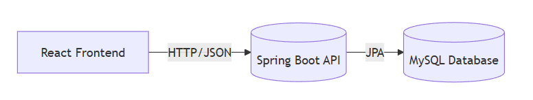

# Capture The Flag (CTF) Web Platform for Cybersecurity Education


A beginner-friendly web-based platform designed to help cybersecurity students build foundational practical skills through hands-on ethical hacking challenges.

---

## 🎥 Demo (Screenshots Preview)

<details>
<summary><strong>Click to view demo preview</strong></summary><br>

<br><br>
<br><br>


</details>

---

## 📌 Table of Contents
- [About the Project](#-about-the-project)
- [Features](#-features)
- [System Architecture](#-system-architecture)
- [Technology Stack](#-technology-stack)
- [Getting Started](#-getting-started)
- [Usage](#-usage)
- [Testing](#-testing-overview)
- [Screenshots & User Manual](#-screenshots--user-manual)
- [Roadmap / Future Enhancements](#-roadmap--future-enhancements)
- [License](#-license)
- [Author](#-author)

---

## 🧩 About the Project

Cybercrime continues to rise globally, yet beginners often lack a safe and accessible environment to learn cybersecurity practically.  
This platform provides a secure and structured learning environment where students solve ethical hacking challenges to develop real-world security skills.

✅ Beginner‑friendly challenges  
✅ Practical exposure to security concepts  
✅ Safe simulated environment  

---

## ✅ Features

| Category | Features |
|---------|----------|
| User | Register, Login, Attempt Challenges, Submit Flags, Track Progress |
| Admin | Manage Users |
| Lecturer | Manage Categories, Challenges & Feedback |
| Learning Support | Hints, Stars, Feedback system |

---

## 🧱 System Architecture

The platform follows a **REST‑based MVC architecture**, ensuring modularity and scalability.



---

## 🛠 Technology Stack

| Layer | Tools |
|------|------|
| Frontend | React.js, Axios |
| Backend | Spring Boot, Spring Security |
| Database | MySQL |
| Development Tools | IntelliJ IDEA, VS Code, Git & GitHub |
| Design / Documentation | Figma, PlantUML |

---

## 🚀 Getting Started

### ✅ Requirements
- Java JDK 17+
- MySQL Server
- Git

### 🔧 Installation

#### 1️⃣ Clone Repository
```bash
git clone https://github.com/Abdu1R4hmn/Capture-The-Flag-Website.git
cd Capture-The-Flag-Website
```

#### 2️⃣ Backend Setup
```bash
cd backend
mvn clean install
```
Update DB settings in:
```
src/main/resources/application.properties
```
Run backend:
```bash
mvn spring-boot:run
```
➡ Backend API: http://localhost:8080

#### 3️⃣ Frontend Setup
```bash
cd ../frontend
npm install
npm run dev
```
➡ Frontend: http://localhost:5173

---

## 🕹 Usage
1. Create account & log in
2. Choose a challenge
3. Submit flag to earn stars
4. Track progress in profile page
5. Admin & Lecturer features visible when authorized

---

## 🧪 Testing Overview

| Testing Type | Focus |
|--------------|------|
| White‑box | Backend logic + security evaluation |
| Black‑box | Functional + UI behavior |
| UAT | User workflow & experience testing |

---

## 🖼 Screenshots & User Manual

<details>
<summary><strong>Click to Expand Full User Manual</strong></summary><br>

### ✅ User Screens
- Home — `assets/screens/manual/home.png`  
- Login — `assets/screens/manual/login.png`  
- Signup — `assets/screens/manual/signup.png`  
- Profile — `assets/screens/manual/profile.png`  
- Manage Profile — `assets/screens/manual/profile2.png`  
- Reset Password — `assets/screens/manual/resetPassword.png`  

### 🧩 Challenge Screens
- Challenges — `assets/screens/manual/challenge.png`  
- Challenge Details — `assets/screens/manual/challengeDetails.png`  
- Hint — `assets/screens/manual/hint.png`  
- Solution — `assets/screens/manual/solution.png`  

### 🔐 Admin Screens
- Admin Dashboard — `assets/screens/manual/adminDash.png`  
- User Management — `assets/screens/manual/userDash.png`  

### 🎓 Lecturer Screens
- Category Management — `assets/screens/manual/categoryDash.png`  
- Challenge Management — `assets/screens/manual/challengeDash.png`  
- Feedback Management — `assets/screens/manual/feedbackDash.png`  

</details>

---

## 🔮 Roadmap / Future Enhancements

- Gamified XP, badges, leaderboard
- OAuth2 login
- Enhanced analytics for instructors

---

## 📌 License
This project is intended for **educational use only**.

---

## 👤 Author
Developed by **Abdulrahman Osama**

---
